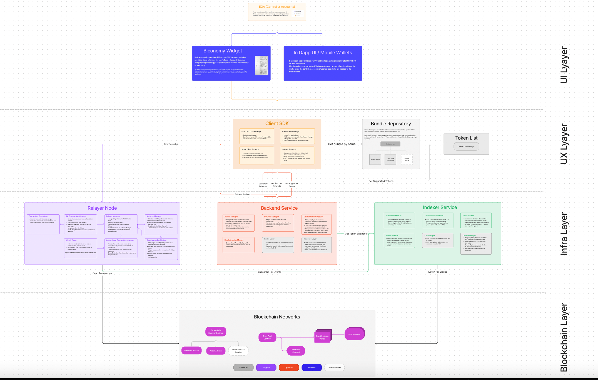

# Biconomy SDK: Your Gateway to ERC4337 Account Abstraction & Smart Accounts 🛠️

  

<p align="center"></p>

## Introduction

The Biconomy SDK is your all-in-one toolkit for building decentralized applications (dApps) with **ERC4337 Account Abstraction** and **Smart Accounts**. This SDK is designed for seamless user experiences and offers non-custodial solutions for user onboarding, transaction management, and gas abstraction.

<p align="center"></p>

## 🌟 Features

- **ERC4337 Account Abstraction**: Simplify user operations and gas payments.
- **Smart Accounts**: Enhance user experience with modular smart accounts.
- **Paymaster Service**: Enable third-party gas sponsorship.
- **Bundler Infrastructure**: Ensure efficient and reliable transaction bundling.
- **Backend Node**: Manage chain configurations and gas estimations.

## 📦 Packages

### Account

Unlock the full potential of **ERC4337 Account Abstraction** with methods that simplify the creation and dispatch of UserOperations, streamlining dApp development and management.

```javascript

import { ECDSAOwnershipValidationModule, DEFAULT_ECDSA_OWNERSHIP_MODULE } from "@biconomy/modules";
import { IBundler, Bundler } from '@biconomy/bundler'
import { DEFAULT_ENTRYPOINT_ADDRESS } from "@biconomy/account"
import { providers } from 'ethers'
import { ChainId } from "@biconomy/core-types"


const module = await ECDSAOwnershipValidationModule.create({
  signer: wallet,
  moduleAddress: DEFAULT_ECDSA_OWNERSHIP_MODULE
  })

const biconomySmartAccount = await BiconomySmartAccountV2.create({
    chainId: ChainId.POLYGON_MUMBAI,
    bundler: bundler,
    paymaster: paymaster, 
    entryPointAddress: DEFAULT_ENTRYPOINT_ADDRESS,
    defaultValidationModule: module,
    activeValidationModule: module
})

console.log("address: ", await biconomySmartAccount.getAccountAddress());
```

### Bundler

Leverage standardized bundler infrastructure for efficient operation of account abstraction across EVM networks.

```javascript

import { IBundler, Bundler } from '@biconomy/bundler'


const bundler: IBundler = new Bundler({
    bundlerUrl: 'https://bundler.biconomy.io/api/v2/80001/<API_KEY>', 
    // Please go to https://dashboard.biconomy.io and generate bundler url     
    chainId: ChainId.POLYGON_MUMBAI,
    entryPointAddress: DEFAULT_ENTRYPOINT_ADDRESS,
  })
```

### Paymaster

Acting as third-party intermediaries, Paymasters have the capability to sponsor gas fees for an account, provided specific predefined conditions are met. Additionally, they can accept gas payments in ERC20 tokens from users' smart accounts, with the Paymaster managing the conversion to native tokens for gas payment.

```javascript
const paymaster: IPaymaster = new BiconomyPaymaster({
    paymasterUrl: '' // From Biconomy Dashboard
});
```

## 🛠️ Quickstart

For a step-by-step guide on integrating **ERC4337 Account Abstraction** and **Smart Accounts** into your dApp using the Biconomy SDK, refer to the [official documentation](https://docs.biconomy.io/docs/overview). You can also start with Quick explore here https://docs.biconomy.io/docs/category/quick-explore  

## 📚 Resources

- [Biconomy Documentation](https://docs.biconomy.io/docs/overview)
- [Biconomy Dashboard](https://dashboard.biconomy.io/)

## 🤝 Contributing

Community contributions are welcome! For guidelines on contributing, please read our [contribution guidelines](./CONTRIBUTING.md).

## 📜 License

This project is licensed under the MIT License. See the [LICENSE.md](./LICENSE.md) file for details.
